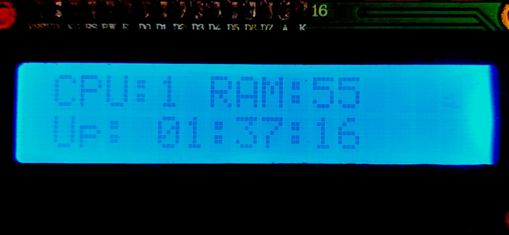

# PC Status In LCD via MQTT

   

This project consists of a Python script running on a PC that collects system statistics (CPU usage, memory usage, uptime) and publishes them via MQTT. An ESP32 microcontroller subscribes to the MQTT topic and displays the data on an I2C LCD screen.

## Features

- Real-time PC monitoring: CPU percentage, RAM percentage, uptime
- MQTT communication between PC and ESP32
- LCD display on ESP32 showing CPU/RAM and uptime
- Automatic data publishing every 1 second

## Requirements

### PC Side

- Python 3.6+
- Libraries: `paho-mqtt`, `psutil`
- Mosquitto MQTT broker installed and running

### ESP32 Side

- ESP32-S3 board
- I2C LCD (16x2, address 0x27 or 0x3F)
- Arduino IDE with ESP32 board support
- Libraries: `WiFi`, `Wire`, `LiquidCrystal_I2C`, `PubSubClient`, `ArduinoJson`

## Setup

### PC Setup

1. Install Python dependencies:

   ```bash
   git clone https://github.com/mojahid2021/PC-Status-In-LCD.git
   cd PC-Status-In-LCD
   ```

   ```bash
   python3 -m venv venv
   source venv/bin/activate
   ```

   ```bash
   pip install -r requirements.txt
   ```

   Or manually:

   ```bash
   pip install paho-mqtt psutil
   ```

2. Install and start Mosquitto MQTT broker:

   ```bash
   sudo apt update
   sudo apt install mosquitto mosquitto-clients
   sudo systemctl start mosquitto
   sudo systemctl enable mosquitto
   ```

3. Verify broker is running:

   ```bash
   ss -tlnp | grep 1883
   ```

### ESP32 Setup

1. Install Arduino IDE and add ESP32 board support:
   - Go to File > Preferences > Additional Boards Manager URLs
   - Add: `https://raw.githubusercontent.com/espressif/arduino-esp32/gh-pages/package_esp32_index.json`
   - Tools > Board > Boards Manager > Install ESP32

2. Install required libraries in Arduino IDE:
   - LiquidCrystal I2C by Frank de Brabander
   - PubSubClient by Nick O'Leary
   - ArduinoJson by Benoit Blanchon

3. Update WiFi credentials in `sketch_dec12a.ino`:

   ```cpp
   const char* WIFI_SSID = "your_wifi_name";
   const char* WIFI_PASS = "your_wifi_password";
   ```

4. Update MQTT server IP if different:

   ```cpp
   const char* MQTT_SERVER = "192.168.0.xxx";  // PC's IP
   ```

## Hardware Connections

Connect the I2C LCD to the ESP32-S3 as follows:

```
ESP32-S3          I2C LCD (16x2)6
---------         -------------
GPIO 8 (SDA) --> SDA
GPIO 9 (SCL) --> SCL
GND            --> GND
3.3V or 5V     --> VCC (check LCD specs)
```

- I2C Address: Typically 0x27 or 0x3F (scan with I2C scanner if unsure)
- Ensure the LCD has a backlight jumper if needed

1. Start the PC script:

   ```bash
   python3 pc_mqtt_stats.py
   ```

## Running in Background

### Option 1: Using systemd (Recommended)

To run the PC script in the background and ensure it starts automatically on boot:

1. Create a systemd service file:

   ```bash
   sudo nano /etc/systemd/system/pc-mqtt-stats.service
   ```

   Add the following content (replace `/path/to/your/project` with the actual path):

   ```ini
   [Unit]
   Description=PC MQTT Stats Publisher
   After=network.target mosquitto.service

   [Service]
   Type=simple
   User=your_username
   WorkingDirectory=/path/to/your/project
   ExecStart=/path/to/your/project/venv/bin/python3 /path/to/your/project/pc_mqtt_stats.py
   Restart=always
   RestartSec=5

   [Install]
   WantedBy=multi-user.target
   ```

2. Reload systemd and enable/start the service:

   ```bash
   sudo systemctl daemon-reload
   sudo systemctl enable pc-mqtt-stats.service
   sudo systemctl start pc-mqtt-stats.service
   ```

3. Check status:

   ```bash
   sudo systemctl status pc-mqtt-stats.service
   ```

4. To stop the service:

   ```bash
   sudo systemctl stop pc-mqtt-stats.service
   ```

5. To disable auto-start on boot:

   ```bash
   sudo systemctl disable pc-mqtt-stats.service
   ```

The script will now run in the background and restart automatically if it crashes. Since the service is enabled, it will start automatically after system restart.

### Option 2: Using nohup

For a simple background run without auto-start on boot:

```bash
source venv/bin/activate
nohup python3 pc_mqtt_stats.py &
```

This runs the script in the background, immune to terminal hangups. However, it won't restart on crashes or system reboot. Use `pkill -f pc_mqtt_stats.py` to stop it.

- **ESP32 not displaying data**: Check Serial Monitor for connection errors. Ensure WiFi credentials and MQTT IP are correct.
- **MQTT connection fails**: Verify Mosquitto is running and ESP32 is on the same network.
- **LCD not working**: Confirm I2C address (0x27 or 0x3F) and wiring (SDA=8, SCL=9 for ESP32-S3).
- **No data received**: Check PC script output for "MQTT connected" and "Published".

## Files

- `pc_mqtt_stats.py`: Python script for PC stats collection and MQTT publishing
- `sketch_dec12a.ino`: Arduino code for ESP32 MQTT subscription and LCD display
- `README.md`: This documentation